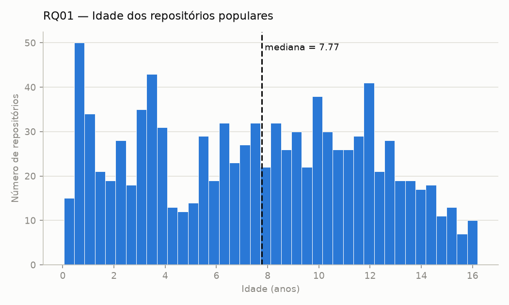
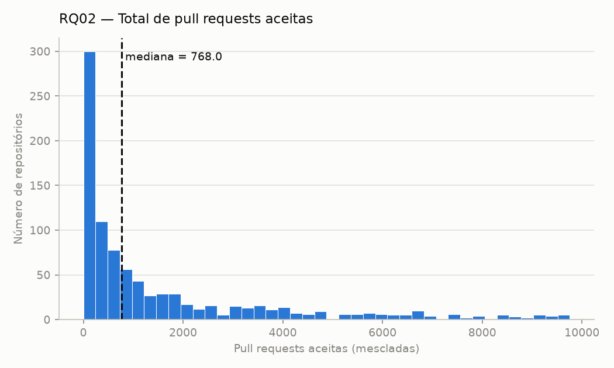
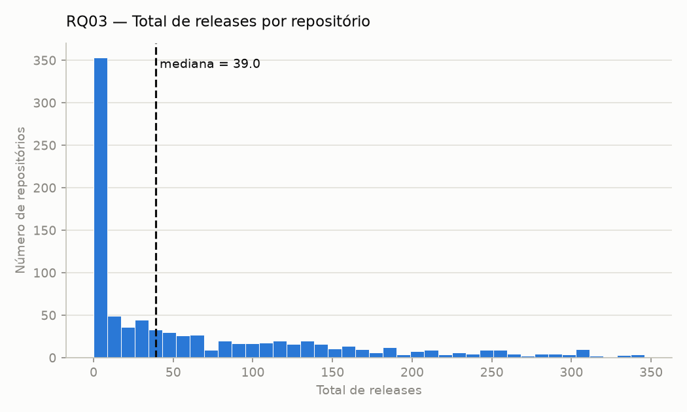
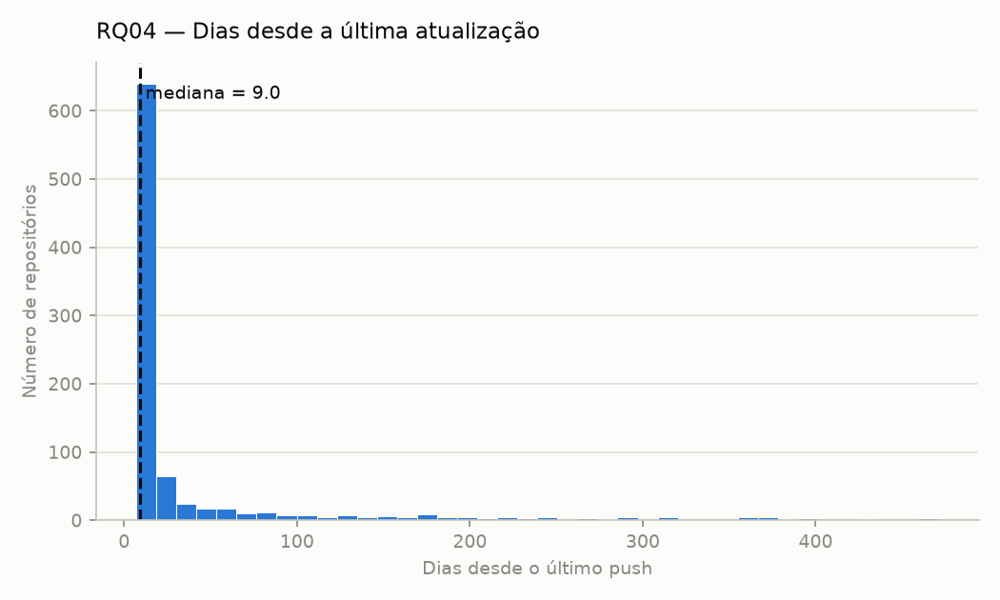
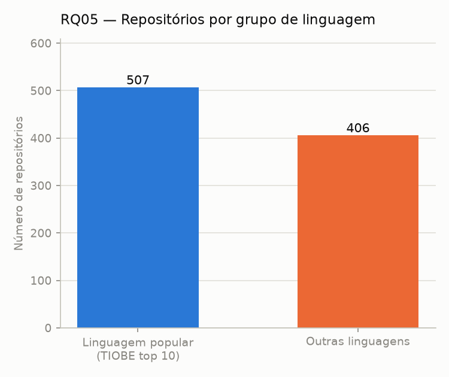
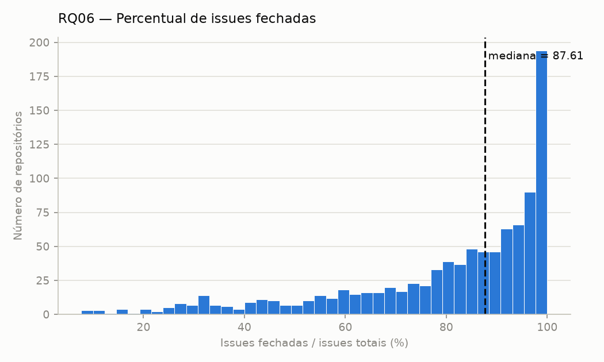

# Relatório — Laboratório 01: Características de repositórios populares

*Versão: Lab01S03 — introdução, hipóteses informais e metodologia de coleta
(S02) + Resultados (Coleta de Dados, Visualização Gráfica), Discussão,
Conclusão e Referências (S03), com base na análise completa dos 1.000
repositórios (`code/src/metrics/full_analysis.py`). Contexto e as subseções
3.1–3.6 da Metodologia (Desafios, Decisões, Etapas, Ferramentas, Tabela de
Métricas, Inovações) ficam para os blocos dos demais integrantes.*

## 1. Introdução e hipóteses informais

Este estudo investiga características de repositórios open-source populares no
GitHub, a partir dos 1.000 repositórios com maior número de estrelas. Para cada
questão de pesquisa (RQ), formulamos abaixo uma hipótese informal, uma
expectativa inicial, baseada em conhecimento prévio sobre o ecossistema
open-source, que será confrontada com os dados coletados no Lab01S03.

**RQ01 — Sistemas populares são maduros/antigos?**
Hipótese: a maioria dos repositórios populares é madura, com vários anos de
existência. Acumular um grande número de estrelas normalmente exige tempo de
exposição e maturação da comunidade em torno do projeto; poucos repositórios
muito recentes conseguem entrar no top de popularidade, mesmo em casos de
"hype" pontual.

**RQ02 — Sistemas populares recebem muita contribuição externa?**
Hipótese: repositórios populares recebem um volume alto de pull requests
aceitas, dado o efeito de rede típico de projetos open-source visíveis (mais
olhos, mais contribuidores). Esperamos, porém, grande variação no percentual
de PRs aceitas em relação ao total, dependendo do quão rigoroso é o processo
de revisão de cada mantenedor.

**RQ03 — Sistemas populares lançam releases com frequência?**
Hipótese: a maioria dos repositórios populares lança releases, mas com forte
variação por tipo de projeto. Bibliotecas e frameworks tendem a ter um
histórico de releases mais consistente, enquanto listas "awesome", tutoriais e materiais de estudo podem nunca ter uma release formal.

**RQ04 — Sistemas populares são atualizados com frequência?**
Hipótese: a maioria dos repositórios populares tem atualizações recentes
(dias/semanas), já que deixar de atualizar tende a reduzir engajamento e
visibilidade ao longo do tempo. Esperamos, no entanto, uma cauda de
repositórios "completos" ou de conteúdo estático (livros, listas de recursos)
que podem ficar longos períodos sem push, mesmo mantendo popularidade.

**RQ05 — Sistemas populares são escritos nas linguagens mais populares?**
Métrica de referência de "linguagens mais populares": **TIOBE Index**
(ranking de agosto/2026, top 10 — https://www.tiobe.com/tiobe-index/), mesma
fonte já usada em `analyze_rq05_rq06.py`.
Hipótese: a maioria dos repositórios populares usa linguagens do topo do
TIOBE (Python, C, C++, Java, C#, JavaScript, entre outras), pois popularidade
de linguagem e de projeto tendem a se reforçar mutuamente — mais
desenvolvedores familiarizados com a linguagem ampliam tanto o público quanto
o pool de contribuidores em potencial.

**RQ06 — Sistemas populares possuem um alto percentual de issues fechadas?**
Hipótese: repositórios populares mantêm um percentual alto de issues
fechadas, pois costumam ter equipes de manutenção mais estruturadas e
processos de triagem mais maduros. Ainda assim, esperamos que projetos muito
grandes (milhares de issues abertas) apresentem percentuais menores, pois o
volume de issues recebido pode superar a capacidade de resposta dos
mantenedores.

**RQ07 (bônus) — Sistemas escritos em linguagens mais populares recebem mais
contribuição externa, lançam mais releases e são atualizados com mais
frequência?**
Hipótese: repositórios em linguagens do topo do TIOBE devem apresentar mais
PRs aceitas e atualizações mais frequentes, pois uma base maior de
desenvolvedores familiarizados com a linguagem amplia o pool de contribuidores
ativos. Já para releases, esperamos uma diferença menor entre grupos de
linguagem, já que a frequência de releases parece depender mais do domínio/tipo
do projeto (biblioteca vs. conteúdo estático) do que da linguagem em si.

## 2. Metodologia de coleta

- Os dados foram coletados via **GraphQL API do GitHub** (`https://api.github.com/graphql`),
  usando um script próprio do grupo (sem bibliotecas de terceiros para acesso à API),
  implementado em `code/src/github_client.py`, `code/src/queries.py` e
  `code/src/collectors/repository_collector.py`.
- A busca utiliza `search(query: "stars:>0 sort:stars-desc", type: REPOSITORY, ...)`,
  paginada com `first`/`after` (cursor), coletando os 1.000 repositórios com maior
  número de estrelas (`code/main.py`).
- Para cada repositório, foram extraídos: nome, dono, URL, data de criação
  (`createdAt`), estrelas (`stargazerCount`), total de releases
  (`releases.totalCount`), data do último push (`pushedAt`), total de pull
  requests (`pullRequests.totalCount`) e PRs mescladas
  (`pullRequests(states: MERGED).totalCount`), linguagem primária
  (`primaryLanguage.name`), total de issues (`issues.totalCount`) e issues
  fechadas (`issues(states: CLOSED).totalCount`).
- Os dados foram exportados para `code/data/raw/top_1000_repositories.csv`
  (UTF-8, separador `;`) via `code/src/exporters/repository_exporter.py`.
- Antes da análise final, os dados foram validados quanto a consistência
  (distribuições, outliers, valores ausentes, contagens) — ver
  `code/data/processed/validation_report_1000_repos.md` para o relatório
  completo dessa validação (issue #8). Resumo: nenhum repositório duplicado,
  nenhuma inconsistência lógica entre contagens totais/subconjuntos, e apenas
  uma lacuna de dados esperada (`primary_language` ausente em 8,7% dos casos).
  Um problema real foi confirmado: o campo `releases.totalCount` da API do
  GitHub tem um teto de 1000, afetando 21 dos 1000 repositórios (2,1%) — para
  esses casos, o total de releases coletado é menor que o real (ex.:
  ggml-org/llama.cpp: 1000 coletado vs. 6.894 real). Isso é uma limitação da
  API, não um erro do script de coleta, e deve ser considerado como ressalva
  metodológica na discussão da RQ03. 

## 3. Resultados

### 3.1 Coleta de Dados

A coleta buscou os 1.000 repositórios com maior número de estrelas do GitHub
e **os 1.000 foram efetivamente obtidos e analisados** — não houve
repositório descartado por dado incompleto: todos os campos obrigatórios
vieram preenchidos em 100% dos casos, exceto `primary_language` (ver abaixo).
A análise final (Lab01S03) roda sobre esses **1.000 repositórios completos**
de `code/data/raw/top_1000_repositories.csv` — não sobre a amostra de 100
usada para validação nos scripts do S01/S02 — via
`code/src/metrics/full_analysis.py`.

A coleta foi executada em **18/08/2026**, como uma foto única no tempo (não
uma série histórica) — o repositório mais recentemente atualizado da amostra
tem `pushed_at` de 18/08/2026, coerente com a data da coleta.

A métrica de RQ06 (percentual de issues fechadas) é uma razão e só pode ser
calculada para repositórios com denominador > 0:

- **RQ06 (percentual de issues fechadas):** 957 de 1.000 repositórios têm ao
  menos 1 issue; os 43 restantes ficam fora do cálculo do percentual.
- **RQ05 (linguagem):** 87 repositórios (8,7%) não têm `primary_language`
  definida pela API, portanto ficam fora do denominador do percentual da
  RQ05, permanecendo nas demais RQs.

Nenhum outro dado ausente foi encontrado (ver validação completa em
`code/data/processed/validation_report_1000_repos.md`, issue #8).

**Outliers.** A validação (issue #8) rodou detecção de outliers via IQR
(intervalo interquartil, limite de 1,5×) em cada métrica numérica, sobre os
1.000 repositórios:

| Métrica | Outliers (IQR) |
|---|---|
| stars | 82 |
| releases_count | 92 |
| pull_requests_count | 118 |
| merged_pull_requests_count | 124 |
| issues_count | 100 |
| closed_issues_count | 97 |
| age_days | 0 |
| days_since_update | 194 |

Nenhum outlier foi removido da amostra. A decisão do grupo foi **manter
todos os valores e reportar mediana em vez de média** em todas as RQs — a
mediana é pouco sensível a valores extremos, então os outliers não distorcem
o número reportado, mas continuam disponíveis para discussão pontual (ex.:
`age_days` não tem nenhum outlier, ou seja, a idade dos repositórios
populares é uma distribuição bem mais homogênea que as demais métricas;
`days_since_update` tem 194 outliers, com casos de até 2.458 dias sem
atualização — repositórios "congelados", como listas e materiais de estudo,
que não deixam de ser populares por isso, então excluí-los distorceria a
amostra em vez de limpá-la). Remover esses casos alteraria artificialmente o
perfil real da população de repositórios populares, que o enunciado pede
para caracterizar como ela é, não como uma versão "aparada" dela.

O único ajuste feito antes da análise foi tratar a **saturação em 1.000** do
campo `releases_count` (21 repositórios, 2,1% da base, ver seção 3.1/Desafios)
como uma limitação de coleta, não como outlier estatístico: a RQ03 é
reportada tanto com a base completa quanto excluindo esses 21 casos, para
mostrar que a ressalva não muda a mediana.

### 3.2 Visualização Gráfica

**RQ01 — Sistemas populares são maduros/antigos?**
Idade calculada a partir de `created_at` até a data da coleta.

Mediana: **7,77 anos** (média 7,68; mínimo 0,04 ano ≈ 2 semanas; máximo
18,37 anos; n = 1.000).

**RQ02 — Sistemas populares recebem muita contribuição externa?**
Total de pull requests aceitas (mescladas) por repositório.

Mediana: **768 pull requests aceitas** (média 4.234,14; n = 1.000).

**RQ03 — Sistemas populares lançam releases com frequência?**
Total de releases por repositório.

Mediana: **39 releases** na base completa (n = 1.000) e **37 releases**
excluindo os 21 repositórios afetados pela saturação do campo `releases_count`
(n = 979) — a diferença é pequena porque o teto rebaixa a cauda superior da
distribuição, não a mediana.

**RQ04 — Sistemas populares são atualizados com frequência?**
Dias entre `pushed_at` e a data da coleta.

Mediana: **9 dias** (média 120,89; máximo 2.458 dias ≈ 6,7 anos; n = 1.000).

**RQ05 — Sistemas populares são escritos nas linguagens mais populares?**
Repositórios cuja `primary_language` está no TIOBE Index top 10 (ago/2026)
vs. demais. 87 repositórios sem `primary_language` definida ficam de fora
deste cálculo.

**55,53%** dos repositórios com linguagem definida (507 de 913) usam uma
linguagem do TIOBE top 10.

**RQ06 — Sistemas populares possuem um alto percentual de issues fechadas?**
Percentual de issues fechadas sobre o total de issues.

Mediana: **87,61%** (média 80,24%; n = 957 repositórios com ao menos 1 issue).

**RQ07 (bônus)** — fica com quem pegar essa issue.

Todos os valores acima são reproduzíveis executando
`code/src/metrics/full_analysis.py`, que também grava os números completos em
`code/data/processed/full_analysis_results.json`.

## 4. Discussão hipótese vs. resultado

**RQ01 (idade):** hipótese **confirmada**. A mediana de 7,77 anos confirma que
repositórios populares são majoritariamente maduros — a maioria tem entre 4 e
14 anos (ver histograma), consistente com a expectativa de que acumular
estrelas exige tempo de exposição. O caso extremo de 0,04 ano (≈ 2 semanas)
confirma também a ressalva da hipótese sobre "hype pontual", mas é exceção,
não regra.

**RQ02 (contribuição externa):** hipótese **confirmada**. A mediana de 768
pull requests aceitas confirma volume relevante de contribuição externa. A
média (4.234,14) bem acima da mediana mostra grande variação entre
repositórios, consistente com a hipótese de que o rigor de revisão de cada
mantenedor influencia o volume de PRs aceitas.

**RQ03 (releases):** hipótese **confirmada**, com ressalva metodológica. A
mediana de 39 (37 sem os casos saturados) mostra que a maioria dos
repositórios populares de fato lança releases, mas a média (126) muito acima
da mediana confirma a variação por tipo de projeto prevista na hipótese
(poucos projetos com centenas/milhares de releases puxam a média, enquanto a
mediana reflete o repositório "típico"). O teto de `releases.totalCount` em
21 repositórios (seção 3.1) não muda a conclusão, mas subestima a cauda
superior da distribuição — deve ser lido como limitação da API, não do
processo de coleta.

**RQ04 (atualização):** hipótese **confirmada**. A mediana de 9 dias mostra
que a grande maioria dos repositórios populares está ativamente mantida.
Como previsto na hipótese, existe uma cauda de repositórios "congelados" —
o máximo de 2.458 dias (~6,7 anos) sem push é consistente com conteúdo
estático (listas, materiais de estudo) que continua popular sem precisar de
manutenção contínua.

**RQ05 (linguagens populares):** hipótese **confirmada, mas por margem
menor do que o esperado**. 55,53% dos repositórios com linguagem definida
usam uma linguagem do TIOBE top 10 — é maioria, mas não a maioria esmagadora
que a hipótese antecipava. Quase metade (44,47%) usa linguagens fora do top
10 do TIOBE, o que sugere que popularidade de repositório e popularidade de
linguagem (medida por um índice geral de mercado, não específico de
open-source) se reforçam menos do que o previsto.

**RQ06 (issues fechadas):** hipótese **confirmada**. Mediana de 87,61% de
issues fechadas é alta, confirmando processos de triagem maduros nos
repositórios populares. A cauda inferior (mínimo 7,69%) é consistente com a
ressalva da hipótese sobre projetos muito grandes, cujo volume de issues
supera a capacidade de resposta da manutenção.

**RQ07 (bônus):** discussão a ser escrita por quem ficar com essa issue.

**O que a validação de dados (issue #8) acrescentou:** foi ela que permitiu
identificar a saturação em `releases_count` a tempo de tratá-la como ressalva
explícita na RQ03 (seção 3.1), em vez de reportar uma mediana distorcida sem
aviso.

## 5. Configuração do processo

O grupo utiliza o **GitHub Projects (v2)** vinculado ao repositório, com
cartões representando Issues reais do repositório (não *draft issues*),
atribuídas a um responsável (campo *Assignee*).

**Colunas do board (campo Status):**
`Backlog → To Do → In Progress → Review → Done`

**Limite de WIP:** 4 issues na coluna **In Progress**.

**Justificativa do WIP:** com o trio atual, o limite de 4 issues em andamento
permite que cada integrante mantenha até 1–2 tarefas em progresso
simultaneamente, equilibrando a carga de trabalho sem perder o controle do
fluxo no quadro, considerando o prazo de cada sprint e o volume de demandas do
laboratório.

**Política de acompanhamento:**
- **Backlog:** tarefas previstas, ainda não priorizadas.
- **To Do:** tarefas selecionadas para execução na sprint.
- **In Progress:** tarefas em desenvolvimento, respeitando o limite de 4 issues.
- **Review:** tarefas concluídas aguardando revisão.
- **Done:** tarefas finalizadas e validadas.

Ao final de cada sprint, um snapshot dos itens do Project (via script GraphQL
próprio) é exportado para CSV, servindo de base para os Labs 04 e 05.

**Link do repositório/GitHub Projects:** `<preencher>`

*(Anexar print do board ao final do laboratório, mostrando o fluxo completo
do Lab01 e a política de WIP em uso — a ser incluído no Relatório Final.)*

## 6. Conclusão

Os 1.000 repositórios mais populares do GitHub confirmam, para todas as RQs
do enunciado, o perfil esperado de um projeto open-source maduro: são
majoritariamente antigos (mediana de 7,77 anos), recebem contribuição externa
relevante (mediana de 768 pull requests aceitas), lançam releases com
frequência (mediana de 39) e permanecem ativamente mantidos (mediana de 9
dias desde o último push), com alta taxa de resolução de issues (87,61%). A
RQ05 confirma a hipótese por uma margem menor do que o esperado: 55,53% dos
repositórios com linguagem definida usam uma linguagem do TIOBE top 10 — é
maioria, mas quase metade (44,47%) usa linguagens fora do top 10, sugerindo
que popularidade de repositório e popularidade de linguagem se reforçam
menos do que a intuição inicial do grupo previa.

**Limitações do estudo:** a amostra é um corte único no tempo (não uma série
histórica), então não captura tendência — apenas o estado atual dos 1.000
repositórios mais populares. Estrelas foram usadas como único proxy de
popularidade, sem medir uso real (downloads, dependentes). O teto de 1.000 em
`releases.totalCount` (21 repositórios) subestima a cauda superior da RQ03,
ainda que não altere a mediana reportada.

**Com mais tempo**, o grupo recotaria via paginação REST os 21 repositórios
afetados pelo teto de releases, para confirmar se a mediana muda ao usar o
valor real em vez do truncado.

## 7. Referências

TIOBE Index. TIOBE Software, ago. 2026. Fonte usada para definir "linguagens
mais populares" nas RQ05 e RQ07, conforme pedido no enunciado do Lab01.
Disponível em: https://www.tiobe.com/tiobe-index/.

GITHUB. GraphQL API Docs. Documentação oficial da API usada para toda a
coleta de dados do laboratório (`code/src/queries.py`,
`code/src/github_client.py`). Disponível em:
https://docs.github.com/en/graphql.

GITHUB. REST API Docs — Releases. Documentação usada na validação de
consistência para confirmar manualmente, via paginação REST
(`GET /repos/{owner}/{repo}/releases`), o teto de 1.000 no campo
`releases.totalCount` da API GraphQL. Disponível em:
https://docs.github.com/en/rest/releases/releases.